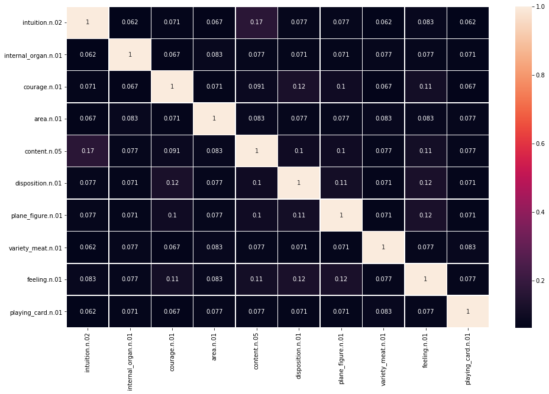
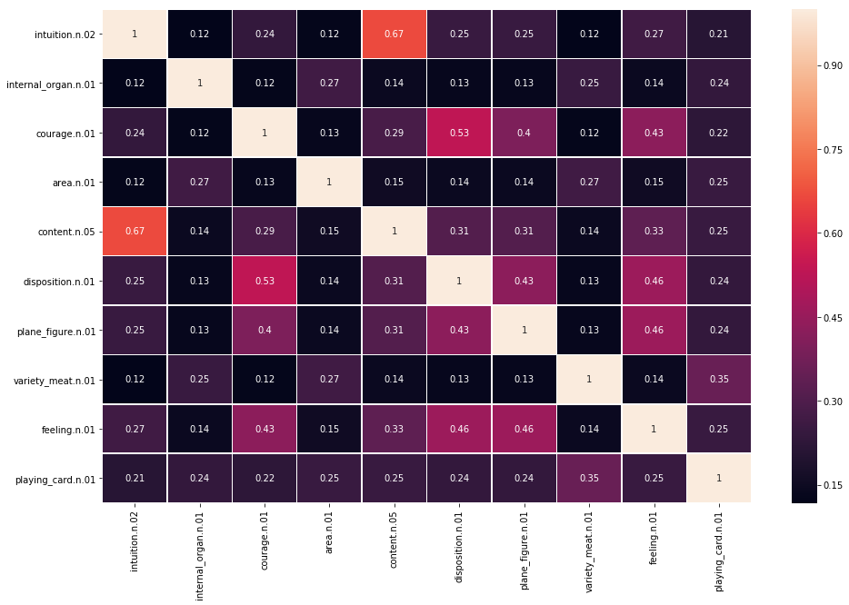

# Структурна лінгвістика
1. Побудуйте ланцюжок походження слів за зразком:

оженитися: (о + (женити + ся))

несприйнятливість: (не + (с+(прийнят+ливість))
атиповий: (а + (тип+овий))
безвідповідально: (без +(відповід + ально))  
мореплавання: (море +(плав+ання))
оподаткувати: (о+(подат+кув))+ати)  
перевтілитися: (пере+(в+(тіл+и)+тися)
схилившись: (с+(хил+ившись))
трьохярусний: (трьох+(ярус+ний))
трьохярусний: (під+(сніж+ник))
зужиткований: (з+(ужиткува́т+ ий)                                                                                                                  

2. Перевірте роботу SnowballStem для спільнокореневих слів. Напишіть ваші спостереження.

truth, truthful, truthfulness, countertruth, untruthful, truthology
flaw, flaws, flawed, flawless, flawlessness, flawlessly,
лес, лесной, лесник, лесничий, лесничество, пролесье
окно, окошко, подоконник, оконный, окнище


<div>
<style scoped>
    .dataframe tbody tr th:only-of-type {
        vertical-align: middle;
    }

    .dataframe tbody tr th {
        vertical-align: top;
    }

    .dataframe thead th {
        text-align: right;
    }
</style>
<table border="1" class="dataframe">
  <thead>
    <tr style="text-align: right;">
      <th></th>
      <th>word</th>
      <th>stemmer_porter</th>
      <th>stemmer_en</th>
      <th>nltk_stemmer_Snowball_en</th>
    </tr>
  </thead>
  <tbody>
    <tr>
      <th>0</th>
      <td>truth</td>
      <td>truth</td>
      <td>truth</td>
      <td>truth</td>
    </tr>
    <tr>
      <th>1</th>
      <td>truthful</td>
      <td>truth</td>
      <td>truth</td>
      <td>truth</td>
    </tr>
    <tr>
      <th>2</th>
      <td>truthfulness</td>
      <td>truth</td>
      <td>truth</td>
      <td>truth</td>
    </tr>
    <tr>
      <th>3</th>
      <td>countertruth</td>
      <td>countertruth</td>
      <td>countertruth</td>
      <td>countertruth</td>
    </tr>
    <tr>
      <th>4</th>
      <td>untruthful</td>
      <td>untruth</td>
      <td>untruth</td>
      <td>untruth</td>
    </tr>
    <tr>
      <th>5</th>
      <td>truthology</td>
      <td>truthologi</td>
      <td>trutholog</td>
      <td>trutholog</td>
    </tr>
    <tr>
      <th>6</th>
      <td>flaw</td>
      <td>flaw</td>
      <td>flaw</td>
      <td>flaw</td>
    </tr>
    <tr>
      <th>7</th>
      <td>flaws</td>
      <td>flaw</td>
      <td>flaw</td>
      <td>flaw</td>
    </tr>
    <tr>
      <th>8</th>
      <td>flawed</td>
      <td>flaw</td>
      <td>flaw</td>
      <td>flaw</td>
    </tr>
    <tr>
      <th>9</th>
      <td>flawless</td>
      <td>flawless</td>
      <td>flawless</td>
      <td>flawless</td>
    </tr>
    <tr>
      <th>10</th>
      <td>flawlessness</td>
      <td>flawless</td>
      <td>flawless</td>
      <td>flawless</td>
    </tr>
    <tr>
      <th>11</th>
      <td>flawlessly</td>
      <td>flawlessli</td>
      <td>flawless</td>
      <td>flawless</td>
    </tr>
  </tbody>
</table>
</div>


<div>
<style scoped>
    .dataframe tbody tr th:only-of-type {
        vertical-align: middle;
    }

    .dataframe tbody tr th {
        vertical-align: top;
    }

    .dataframe thead th {
        text-align: right;
    }
</style>
<table border="1" class="dataframe">
  <thead>
    <tr style="text-align: right;">
      <th></th>
      <th>word</th>
      <th>stemmer_porter</th>
      <th>stemmer_ru</th>
      <th>nltk_stemmer_Snowball_ru</th>
    </tr>
  </thead>
  <tbody>
    <tr>
      <th>0</th>
      <td>лес</td>
      <td>лес</td>
      <td>лес</td>
      <td>лес</td>
    </tr>
    <tr>
      <th>1</th>
      <td>лесной</td>
      <td>лесной</td>
      <td>лесн</td>
      <td>лесн</td>
    </tr>
    <tr>
      <th>2</th>
      <td>лесник</td>
      <td>лесник</td>
      <td>лесник</td>
      <td>лесник</td>
    </tr>
    <tr>
      <th>3</th>
      <td>лесничий</td>
      <td>лесничий</td>
      <td>леснич</td>
      <td>леснич</td>
    </tr>
    <tr>
      <th>4</th>
      <td>лесничество</td>
      <td>лесничество</td>
      <td>лесничеств</td>
      <td>лесничеств</td>
    </tr>
    <tr>
      <th>5</th>
      <td>пролесье</td>
      <td>пролесье</td>
      <td>пролес</td>
      <td>пролес</td>
    </tr>
    <tr>
      <th>6</th>
      <td>окно</td>
      <td>окно</td>
      <td>окн</td>
      <td>окн</td>
    </tr>
    <tr>
      <th>7</th>
      <td>окошко</td>
      <td>окошко</td>
      <td>окошк</td>
      <td>окошк</td>
    </tr>
    <tr>
      <th>8</th>
      <td>подоконник</td>
      <td>подоконник</td>
      <td>подоконник</td>
      <td>подоконник</td>
    </tr>
    <tr>
      <th>9</th>
      <td>оконный</td>
      <td>оконный</td>
      <td>окон</td>
      <td>окон</td>
    </tr>
    <tr>
      <th>10</th>
      <td>окнище</td>
      <td>окнище</td>
      <td>окнищ</td>
      <td>окнищ</td>
    </tr>
  </tbody>
</table>
</div>


<div>
<style scoped>
    .dataframe tbody tr th:only-of-type {
        vertical-align: middle;
    }

    .dataframe tbody tr th {
        vertical-align: top;
    }

    .dataframe thead th {
        text-align: right;
    }
</style>
<table border="1" class="dataframe">
  <thead>
    <tr style="text-align: right;">
      <th></th>
      <th>word</th>
      <th>stemmer_porter</th>
      <th>stemmer_ru</th>
      <th>UkrainianStemmer</th>
    </tr>
  </thead>
  <tbody>
    <tr>
      <th>0</th>
      <td>ліс</td>
      <td>ліс</td>
      <td>ліс</td>
      <td>ліс</td>
    </tr>
    <tr>
      <th>1</th>
      <td>лісовий</td>
      <td>лісовий</td>
      <td>лісов</td>
      <td>лісов</td>
    </tr>
    <tr>
      <th>2</th>
      <td>лісник</td>
      <td>лісник</td>
      <td>лісник</td>
      <td>лісник</td>
    </tr>
    <tr>
      <th>3</th>
      <td>лісничий</td>
      <td>лісничий</td>
      <td>ліснич</td>
      <td>ліснич</td>
    </tr>
    <tr>
      <th>4</th>
      <td>лісництво</td>
      <td>лісництво</td>
      <td>лісництв</td>
      <td>лісництв</td>
    </tr>
    <tr>
      <th>5</th>
      <td>вікно</td>
      <td>вікно</td>
      <td>вікно</td>
      <td>вікн</td>
    </tr>
    <tr>
      <th>6</th>
      <td>віконце</td>
      <td>віконце</td>
      <td>віконц</td>
      <td>віконц</td>
    </tr>
    <tr>
      <th>7</th>
      <td>підвіконня</td>
      <td>підвіконня</td>
      <td>підвікон</td>
      <td>підвіконн</td>
    </tr>
    <tr>
      <th>8</th>
      <td>віконний</td>
      <td>віконний</td>
      <td>вікон</td>
      <td>віконн</td>
    </tr>
  </tbody>
</table>
</div>


<div>
<style scoped>
    .dataframe tbody tr th:only-of-type {
        vertical-align: middle;
    }

    .dataframe tbody tr th {
        vertical-align: top;
    }

    .dataframe thead th {
        text-align: right;
    }
</style>
<table border="1" class="dataframe">
  <thead>
    <tr style="text-align: right;">
      <th></th>
      <th>word</th>
      <th>stemmer_porter</th>
      <th>stemmer_ru</th>
      <th>UkrainianStemmer</th>
    </tr>
  </thead>
  <tbody>
    <tr>
      <th>0</th>
      <td>невосприимчивость</td>
      <td>невосприимчивость</td>
      <td>невосприимчив</td>
      <td>невосприимчивост</td>
    </tr>
    <tr>
      <th>1</th>
      <td>несприйнятливість</td>
      <td>несприйнятливість</td>
      <td>несприйнятливіст</td>
      <td>несприйнятливіст</td>
    </tr>
    <tr>
      <th>2</th>
      <td>атиповий</td>
      <td>атиповий</td>
      <td>атипов</td>
      <td>атипов</td>
    </tr>
    <tr>
      <th>3</th>
      <td>безвідповідально</td>
      <td>безвідповідально</td>
      <td>безвідповідальн</td>
      <td>безвідповідальн</td>
    </tr>
    <tr>
      <th>4</th>
      <td>мореплавання</td>
      <td>мореплавання</td>
      <td>мореплаван</td>
      <td>мореплаванн</td>
    </tr>
    <tr>
      <th>5</th>
      <td>оподаткувати</td>
      <td>оподаткувати</td>
      <td>оподаткуват</td>
      <td>оподаткув</td>
    </tr>
    <tr>
      <th>6</th>
      <td>перевтілитися</td>
      <td>перевтілитися</td>
      <td>перевтілит</td>
      <td>перевтілит</td>
    </tr>
    <tr>
      <th>7</th>
      <td>схилившись</td>
      <td>схилившись</td>
      <td>схил</td>
      <td>схил</td>
    </tr>
    <tr>
      <th>8</th>
      <td>трьохярусний</td>
      <td>трьохярусний</td>
      <td>трьохярусн</td>
      <td>трьохярусн</td>
    </tr>
    <tr>
      <th>9</th>
      <td>підсніжник</td>
      <td>підсніжник</td>
      <td>підсніжник</td>
      <td>підсніжник</td>
    </tr>
    <tr>
      <th>10</th>
      <td>зужиткований</td>
      <td>зужиткований</td>
      <td>зужиткован</td>
      <td>зужиткован</td>
    </tr>
  </tbody>
</table>
</div>


2 Висновок:
    Стемери: Є реалізації для російської/англійської мов, для української знайшов одін під ліцензією на гітхабі
    Портер стемер - найгірший як на мене, додає лишні символи чомусь
    Як NLTK так і Snowball стемер показують себе однаково
    Основна проблема, корінь реченння погано очищується, залишаються перефікси і суфікси
    PoS не має значення і все може обрізатися до одного корення
    
    Використовувати тільки там де така функцінальність потрібна


3. Визначте частину мови виділеного слова і зв'язок до його батька (за зразком):

{I} like turtles.: pronoun, nsubj(like, I)
I {like} turtles.: verb, root(ROOT, like)
I like {turtles}.: noun, dobj(like, turtles)

by spacy:
    I like turtles.: PRON, nsubj(like, I)
    I like turtles.: VERB, root(ROOT, like)
    We can but hope that everything will be fine.: CCONJ, cc(can, but)
    It's sad but true.: CCONJ, cc(sad, but)
    Jack brings nothing but trouble.: ADP, prep(nothing, but)
    This hot dog isn't as big as usual.: ADV, advmod(big, as)
    This hot dog isn't as big as usual.: ADP, prep(big, as)
    This hot dog isn't as big as usual.: ADV, advmod(big, as)
    This hot dog isn't as big as usual.: ADP, prep(big, as)
    This hot dog isn't as big as I expected.: ADV, advmod(big, as)
    This hot dog isn't as big as I expected.: ADP, mark(expected, as)
    I work as a teacher.: ADP, prep(work, as)
    Let's do it this way!: NOUN, npadvmod(do, way)
    This is way too much!: ADV, advmod(much, way)
    The prices are going down.: PART, prt(going, down)
    Someone pushed him and he fell down the stairs.: ADP, prep(fell, down)
    I’ve been feeling rather down lately.: ADV, advmod(feeling, down)
    It's not easy to down a cup of coffee in one gulp.: VERB, xcomp('s, down)
    Bring a down jacket and a pair of gloves, and you'll be fine.: ADJ, amod(jacket, down)
    

by my self
We can {but} hope that everything will be fine.: CCONJ, cc(can, but)
It's sad {but} true.: CCONJ, cc(sad, but)
Jack brings nothing {but} trouble.: ADP, prep(nothing, but)
{As} we were talking, I realised how to solve the issue. ADV, mark(talking, as)
This hot dog isn't as big {as} usual.: ADV, amod(usual, as)
This hot dog isn't as big {as} I expected.: ADP, mark(expected, as)
I work {as} a teacher.: ADP, prep(work, as)
Let's do it this {way}!: NOUN, npadvmod(do, way)
This is {way} too much!: ADV, advmod(much, way)
The prices are going {down}.: PART, prt(going, down)
Someone pushed him and he fell {down} the stairs.: ADP, prep(fell, down)
I’ve been feeling rather {down} lately.: ADV, advmod(feeling, down)
It's not easy to {down} a cup of coffee in one gulp.: VERB, xcomp('s, down)
Bring a {down} jacket and a pair of gloves, and you'll be fine.: ADJ, amod(jacket, down)4. Визначте частину мови виділеного слова, його лему і зв'язок до його батька (за зразком):


{Я} люблю черепашок.: займенник, я, nsubj(люблю, Я)
Я {люблю} черепашок.: дієслово, любити, root(ROOT, люблю)
Я люблю {черепашок}.: іменник, черепашка, dobj(люблю, черепашок)

Рада міністрів Європейського союзу затвердила угоду про спрощений порядок видачі віз для України.: NOUN, віза,  dobj(видачі , віз)
Батько Себастьяна віз на санях їх театральний гурт до Львова.: VERB, везти,  Root(ROOT, віз)
А ще дивний елемент інтер’єру – віз із продукцією одного з херсонських виробників.: NOUN, віз,  Root(ROOT , віз)
У цю мить повз Євгена пролетів останній вагон товарняка.: ADV, повз,  ADVMod( Євгена, повз)
Кліпнув очима і побачив малого песика, який саме пробігав повз у бік села.: ADV, повз,  advmod( села, повз)
Степанко перестав кричати, тільки ламкий стогін повз йому із грудей.: VERB, повзти,  ccomp(кричати , повз)
Часу не гай – декларацію подай!: VERB, гаяти,  ccomp(декларацію, гай)
І коляд заспівали, і гай врятували.: NOUN, гай,  dobj(врятували , гай)
Гай, чи ви забулися, братове?: intj, гай,  (забулися , Гай)
Ось присіла на край ліжка.: NOUN, край,  dobj(присіла , край)
Поставив ту кузню не край дороги, як було заведено, а на Красній горі, біля Прадуба.: prep, край,  advmod( дороги, край)
Розповідаючи про передній край лінґвістики, фон Лібіх, як завжди, мислив широко і глобально.: NOUN, край,  dobj(Розповідаючи , край)
Не край мені серце.: VERB, краяти,  root( root, край)
І щойно тоді додаємо до борщу смажену цибулю.: conj, щойно,  (додаємо , щойно)
Бо щойно я задрімав, віддавши тіло подушці з периною, як мене розбудив поштовх у бік.: PRCL, щойно,  ( , щойно)5. Побудуйте синтаксичну структуру речень за зразком:


Я люблю черепашок.
nsubj(люблю, Я)
root(ROOT, люблю)
dobj(люблю, черепашок)

Пригадую, уже згодом, коли я відбував свій термін у таборі № 36 у Кучино Пермської області, я отримав від Михасі листівку з жартівливим описом того, як Київ готується до святкування свого 1500-ліття.
6C приземляється на плече, перекочуючись, пролітає метрів п’ятдесят і витягується на снігу за кілька кроків від забризканої палаючими уламками посадкової смуги.
Дівчина стояла там, де й була, і намагалася привести до ладу скуйовджене волосся, вкрай розлючена тим, що це побачили водії, які чекали на переїзді.

не зроблено


6. Виберіть одне cлово зі списку та побудуйте лексико-семантичні зв'язки до трьох різних значень цього слова. Фактично, потрібно побудувати WordNet-подібні вузли. Значення слів можна перевірити у СУМі та Словниках України.

Слова на вибір: вік, стіна, добро, серце, центр, куля, міст, ланцюг, бік, дух.

слово - серце
[(Synset('heart.n.01'), 'the locus of feelings and intuitions'),
 (Synset('heart.n.02'),
  'the hollow muscular organ located behind the sternum and between the lungs; its rhythmic contractions move the blood through the body'),
 (Synset('heart.n.03'), 'the courage to carry on'),
 (Synset('center.n.01'),
  'an area that is approximately central within some larger region'),
 (Synset('kernel.n.03'),
  'the choicest or most essential or most vital part of some idea or experience'),
 (Synset('heart.n.06'), 'an inclination or tendency of a certain kind'),
 (Synset('heart.n.07'),
  'a plane figure with rounded sides curving inward at the top and intersecting at the bottom; conventionally used on playing cards and valentines'),
 (Synset('heart.n.08'),
  'a firm rather dry variety meat (usually beef or veal)'),
 (Synset('affection.n.01'), 'a positive feeling of liking'),
 (Synset('heart.n.10'),
  'a playing card in the major suit that has one or more red hearts on it')]


path_similarity


lch_similarity


wup_similarity


path


```python
print_path(heart_types[0],heart_types[1])    
```


    [Synset('heart.n.01'),
     Synset('intuition.n.02'),
     Synset('impression.n.01'),
     Synset('idea.n.01'),
     Synset('content.n.05'),
     Synset('cognition.n.01'),
     Synset('psychological_feature.n.01'),
     Synset('abstraction.n.06'),
     Synset('entity.n.01'),
     Synset('physical_entity.n.01'),
     Synset('thing.n.12'),
     Synset('part.n.03'),
     Synset('body_part.n.01'),
     Synset('organ.n.01'),
     Synset('internal_organ.n.01'),
     Synset('heart.n.02')]


```python
print_path(heart_types[0],heart_types[4])
```


    [Synset('heart.n.01'),
     Synset('intuition.n.02'),
     Synset('impression.n.01'),
     Synset('idea.n.01'),
     Synset('content.n.05'),
     Synset('kernel.n.03')]


```python
print_path(heart_types[2],heart_types[5])
```


    [Synset('heart.n.03'),
     Synset('courage.n.01'),
     Synset('spirit.n.03'),
     Synset('character.n.03'),
     Synset('trait.n.01'),
     Synset('nature.n.04'),
     Synset('disposition.n.01'),
     Synset('heart.n.06')]


